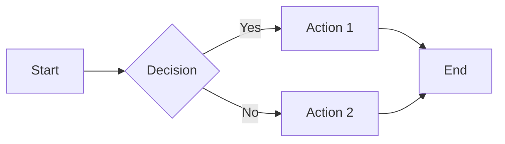

# Fumadocs MDX Usage Guide

Manage Fumadocs content collections and MDX documents.

## Define Content Collections

### Doc Type

Markdown/MDX document files:

```typescript
import { defineCollections } from 'fumadocs-mdx/config';
import { z } from 'zod';

export const blog = defineCollections({
  type: 'doc',
  dir: './content/blog',
  schema: z.object({
    title: z.string(),
    date: z.string().optional(),
    tags: z.array(z.string()).default([]),
    featured: z.boolean().default(false),
  }),
  mdxOptions: {
    remarkPlugins: [remarkAdmonition()],
    rehypePlugins: [rehypeCode()],
  },
});
```

### Meta Type

JSON/YAML metadata files:

```typescript
export const metaFiles = defineCollections({
  type: 'meta',
  dir: './content/meta',
  schema: z.object({
    name: z.string(),
    url: z.string(),
    description: z.string().optional(),
  }),
  files: ['config.json', 'meta/*.json'],
});
```

## Schema Definition

### Using Zod

```typescript
schema: z.object({
  title: z.string().min(10),
  description: z.string().max(200),
  published: z.coerce.date(),
  author: z.string(),
});
```

### Using Function

```typescript
schema: (ctx) => {
  return z.object({
    title: z.string(),
    path: z.string().default(ctx.path),
    filename: z.string().default(ctx.filename),
  });
}
```

### Standard Schema

Supports standard Schema-compatible libraries, such as Zod.

## MDX Options

### Preset Configuration

```typescript
import { applyMdxPreset } from 'fumadocs-mdx/mdx';

export const docs = defineCollections({
  type: 'doc',
  mdxOptions: applyMdxPreset({
    remarkPlugins: [remarkAdmonition()],
    rehypePlugins: [rehypeCode()],
  }),
});
```

### Disable Preset

```typescript
mdxOptions: {
  // Completely custom
  remarkPlugins: [remarkAdmonition()],
  rehypePlugins: [rehypeCode()],
}
```

## Postprocess API

### Include Processed Markdown

```typescript
export const docs = defineDocs({
  docs: {
    postprocess: {
      includeProcessedMarkdown: true,
    },
  },
});
```

Access:

```typescript
const page = await page.data.getText('processed');

// Use processed markdown
const html = await page.data.getHtml();
```

### Export Build-Time Data

```typescript
export const docs = defineDocs({
  docs: {
    postprocess: {
      valueToExport: ['metadata', 'toc'],
    },
  },
});
```

Access in MDX files:

```typescript
// content/docs/guide.mdx
export const metadata = {
  title: 'My Guide',
  date: '2024-01-01',
};

export const toc = {
  heading: 'Getting Started',
};
```

Import in other files:

```typescript
import { metadata, toc } from './guide.mdx';
```

## Workspace Support

### Multi-Workspace

```typescript
export default defineDocs({
  dir: 'content/docs',
  docs: {
    dir: 'guides',
  },
  meta: {
    dir: 'metadata',
  },
  blog: {
    dir: 'content/blog',
  },
});
```

### Custom Collectors

```typescript
export default defineDocs({
  dir: 'content/docs',
  collections: {
    posts: defineCollections({
      type: 'doc',
      dir: 'content/blog',
    }),
    meta: defineCollections({
      type: 'meta',
      dir: 'metadata',
    }),
  },
});
```

## TypeScript Type Generation

### Generate Types

```bash
npx fumadocs-mdx typegen
```

### Skip Dev Server

```bash
npx fumadocs-mdx typegen --skip-dev-server
```

### Output to Specific File

```bash
npx fumadocs-mdx typegen --out-file src/types.d.ts
```

### Add Script in package.json

```json
{
  "scripts": {
    "typegen": "fumadocs-mdx typegen"
  }
}
```

## File Imports

### Import from Other Files

```typescript
import { include } from 'fumadocs-mdx/include';

export const sharedContent = include({
  path: './content/shared/intro.mdx',
});

export const footerContent = include({
  path: './content/shared/footer.mdx',
});
```

### Dynamic Import

```typescript
export const docs = defineCollections({
  type: 'doc',
  dir: './content/docs',
  dynamic: true,
});
```

### Batch Import

```typescript
import { include } from 'fumadocs-mdx/include';

export const components = include({
  path: './content/components/*.mdx',
});
```

## Performance Optimization

### Lazy Loading

```typescript
export const blog = defineCollections({
  type: 'doc',
  dir: './content/blog',
  async: true,
  schema: z.object({
    title: z.string(),
  }),
});
```

### Disable Lazy Loading

```typescript
export const docs = defineCollections({
  type: 'doc',
  dir: './content/docs',
  async: false,
});
```

## Content Authoring

### Frontmatter

```typescript
---
title: "My Document"
description: "A brief description"
date: "2024-01-01"
tags: ["guide", "tutorial"]
draft: false
---

# My Document

Content here...
```

### Custom Properties

```typescript
---
title: "API Reference"
apiVersion: "1.0.0"
endpoint: "/api/v1/users"
---

# API Reference
```

## Markdown Features

### Math Formulas

```typescript
import { remarkMath } from 'fumadocs-mdx/mdx';
import { rehypeKatex } from 'rehype-katex';

export const docs = defineDocs({
  type: 'doc',
  mdxOptions: {
    remarkPlugins: [remarkMath()],
    rehypePlugins: [rehypeKatex()],
  },
});
```

### Mermaid Diagrams

```typescript
import { remarkMermaid } from 'fumadocs-mdx/mdx';

export const docs = defineDocs({
  type: 'doc',
  mdxOptions: {
    remarkPlugins: [remarkMermaid()],
  },
});
```

```markdown

```

### Twoslash

```typescript
import { remarkTwoslash } from 'fumadocs-mdx/mdx';

export const docs = defineDocs({
  type: 'doc',
  mdxOptions: {
    remarkPlugins: [remarkTwoslash()],
  },
});
```

```typescript
function greet(name: string): string {
  return `Hello, ${name}!`;
}
```

**Reference Documentation**:
- [MDX Documentation](https://www.fumadocs.dev/docs/mdx)
- [Collections Configuration](https://www.fumadocs.dev/docs/mdx/collections)
- [Global Options](https://www.fumadocs.dev/docs/mdx/global)
- [MDX Preset](https://www.fumadocs.dev/docs/mdx/mdx)
- [TypeScript Type Generation](https://www.fumadocs.dev/docs/mdx/typegen)